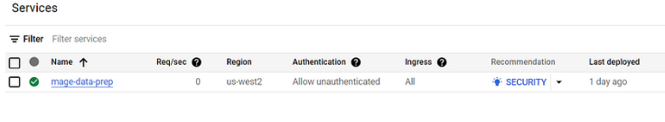

## Deploying Mage to Google Cloud using Terraform

### Prerequisites
- Terraform
- Google Cloud SDK (`gcloud` CLI)
- Google Cloud permissions
- Mage Terraform templates

### Terraform Setup

1. **Service Account Setup**:
   - Make sure you have a service account created for Google Cloud.
   - Generate JSON credentials for the service account.

2. **Directory Setup**:
   - Create a directory named `terraform` for your Terraform files.
   - Inside the `terraform` directory:
     - Create a subdirectory named `keys`.
     - Navigate into the `keys` directory.
     - Create a JSON file, e.g., `my-creds.json`, to store your Google Cloud credentials.
     - Open `my-creds.json` and paste the contents of your JSON credentials.
     - Save and close the file.

3. **Terraform Configuration**:
   - Return to the `terraform` directory.
   - Optionally, open the directory in your preferred code editor.
   - Create a new Terraform configuration file named `main.tf` to define your infrastructure.


## Terraform Configuration

```hcl
terraform {
  required_providers {
    google = {
      source  = "hashicorp/google"
      version = "5.23.0"
    }
  }
}

provider "google" {
  # credentials = "./keys/my-creds.json"
  project = "majestic-legend-419120"
  region  = "us-central1"
}

```
## Using Credentials in Git Bash

I prefer not to store my credentials directly in my code, i can utilize environment variables or Git Bash configurations. Here's how to do it:


Check out one of my publications. This will help you understand how to set up a GCP account for Terraform more effectively.

[How to Set Up a Service Account in GCP for a Data Engineering Project](https://medium.com/@1box/how-to-set-up-a-service-account-in-gcp-for-a-data-engineering-project-5981167e6d29)

The next step is to authenticate Google Cloud credentials in our `gcloud` CLI.

### Overview
Here, we're creating an app using Google Cloud Run and setting up persistent storage on Google Cloud. Follow these steps to proceed:

1. This action will direct us to the authentication page of the `gcloud` CLI, where we can authenticate using our Gmail account and system credentials.


##### This will be the result. :


Now that we've completed the previous steps, let's add permissions in Google Cloud for our Mage. The required permissions are as follows:

- Artifact Registry Reader
- Artifact Registry Writer
- Cloud Run Developer
- Cloud SQL Admin
- Service Account Token


## Deploying Mage to Google Cloud

1. Head back to Git Bash.
2. Navigate to your Terraform repository.
3. Download or pull the Mage Terraform template.


```bash
$ git clone https://github.com/mage-ai/mage-ai-terraform-templates.git

User@TIDO-LAPTOP MINGW64 ~/Desktop/projects/uk_cycling_end_to_end_data_engineering_project
$ cd mage-ai-terraform-templates

User@TIDO-LAPTOP MINGW64 ~/Desktop/projects/uk_cycling_end_to_end_data_engineering_project/mage-ai-terraform-templates (master)
$ ls -la
total 57
drwxr-xr-x 1 User 197608     0 Apr  6 23:28 ./
drwxr-xr-x 1 User 197608     0 Apr  6 23:28 ../
drwxr-xr-x 1 User 197608     0 Apr  6 23:28 .git/
-rw-r--r-- 1 User 197608   753 Apr  6 23:28 .gitignore
-rw-r--r-- 1 User 197608 11558 Apr  6 23:28 LICENSE
-rw-r--r-- 1 User 197608    96 Apr  6 23:28 README.md
drwxr-xr-x 1 User 197608     0 Apr  6 23:28 aws/
drwxr-xr-x 1 User 197608     0 Apr  6 23:28 aws-code-pipeline/
drwxr-xr-x 1 User 197608     0 Apr  6 23:28 aws-dev/
drwxr-xr-x 1 User 197608     0 Apr  6 23:28 aws-eks/
drwxr-xr-x 1 User 197608     0 Apr  6 23:28 azure/
drwxr-xr-x 1 User 197608     0 Apr  6 23:28 digitalocean/
drwxr-xr-x 1 User 197608     0 Apr  6 23:28 gcp/
drwxr-xr-x 1 User 197608     0 Apr  6 23:28 gcp-dev/

User@TIDO-LAPTOP MINGW64 ~/Desktop/projects/uk_cycling_end_to_end_data_engineering_project/mage-ai-terraform-templates (master)
$ cd gcp

User@TIDO-LAPTOP MINGW64 ~/Desktop/projects/uk_cycling_end_to_end_data_engineering_project/mage-ai-terraform-templates/gcp (master)
$ code .
 ```

Once that it's done, let's edit our Terraform template.

1. In `variables.tf`, set the `project_id` default value to your GCP project ID.
2. Enable the Cloud Filestore API:
   - Visit the Google Cloud Console.
   - Navigate to "APIs & Services" > "Library".
   - Search for "Cloud Filestore API".
   - Click on the API and enable it.

Perform the following steps to solve the "Quota 'SECURITY_POLICY_RULES' exceeded. Limit: 0.0 globally" error when running `terraform apply`:

1. Delete the `load_balancer.tf` file:
   - Delete the `load_balancer.tf` file from your Terraform project.
2. Comment or delete the relevant lines in `main.tf`:
   - In the `main.tf` file, comment or delete the rows that differentiate the load balancer. Specifically, comment or delete lines 148, 166, 167, and 168.

Once you have made these changes, you can run `terraform destroy` to delete any previously created infrastructure from failed attempts. Then, you can re-run `terraform apply` to deploy your infrastructure without the load balancer, which should resolve the quota exceeded error.

It's important to note that by removing the load balancer, you will lose its functionality in your deployment. However, you will be able to continue with the deployment.

Please note that this solution is specific to the issue related to the load balancer and security policy quota on GCP. If you encounter a different error or have a different issue, please provide more details so that we can assist you further.

Once we are done, two resources will be added to Google Cloud.

Now let's head over to our Google Cloud project, then navigate to Cloud Run to see what is running.



Click on your project, then copy the link and run it in Google Chrome. Once done, you have successfully pushed your project app to Google Cloud.


