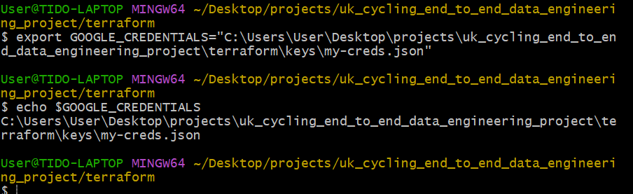
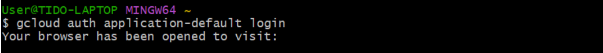
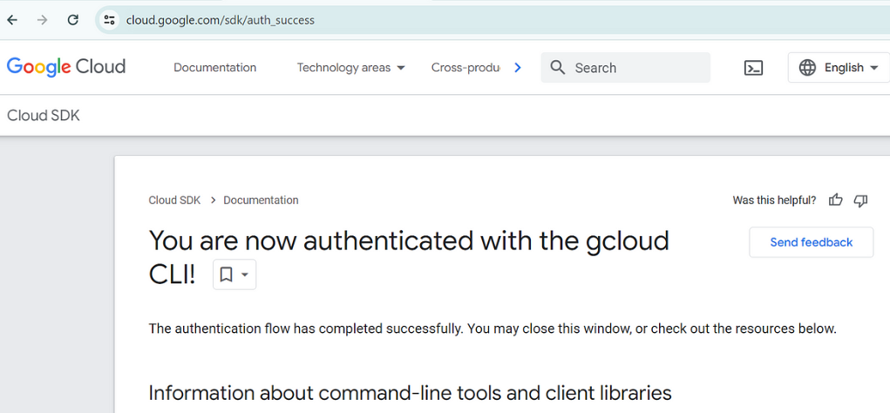
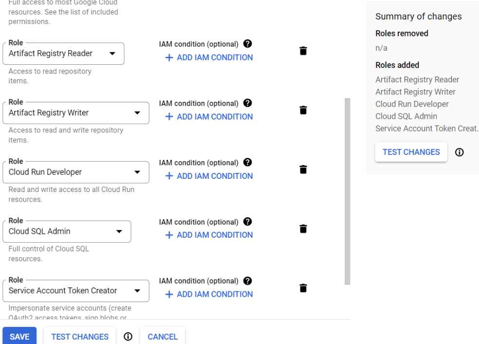

## Deploying Mage to Google Cloud using Terraform

### Prerequisites
- Terraform
- Google Cloud SDK (`gcloud` CLI)
- Google Cloud permissions
- Mage Terraform templates

### Terraform Setup

1. **Service Account Setup**:
   - Make sure you have a service account created for Google Cloud.
   - Generate JSON credentials for the service account.

2. **Directory Setup**:
   - Create a directory named `terraform` for your Terraform files.
   - Inside the `terraform` directory:
     - Create a subdirectory named `keys`.
     - Navigate into the `keys` directory.
     - Create a JSON file, e.g., `my-creds.json`, to store your Google Cloud credentials.
     - Open `my-creds.json` and paste the contents of your JSON credentials.
     - Save and close the file.

3. **Terraform Configuration**:
   - Return to the `terraform` directory.
   - Optionally, open the directory in your preferred code editor.
   - Create a new Terraform configuration file named `main.tf` to define your infrastructure.


## Terraform Configuration

```hcl
terraform {
  required_providers {
    google = {
      source  = "hashicorp/google"
      version = "5.23.0"
    }
  }
}

provider "google" {
  # credentials = "./keys/my-creds.json"
  project = "majestic-legend-419120"
  region  = "us-central1"
}

```
## Using Credentials in Git Bash

I prefer not to store my credentials directly in my code, i can utilize environment variables or Git Bash configurations. Here's how to do it:



Check out one of my publications. This will help you understand how to set up a GCP account for Terraform more effectively.

[How to Set Up a Service Account in GCP for a Data Engineering Project](https://medium.com/@1box/how-to-set-up-a-service-account-in-gcp-for-a-data-engineering-project-5981167e6d29)

The next step is to authenticate Google Cloud credentials in our `gcloud` CLI.

### Overview
Here, we're creating an app using Google Cloud Run and setting up persistent storage on Google Cloud. Follow these steps to proceed:

1. This action will direct us to the authentication page of the `gcloud` CLI, where we can authenticate using our Gmail account and system credentials.



##### This will be the result. :




Now that we've completed the previous steps, let's add permissions in Google Cloud for our Mage. The required permissions are as follows:

- Artifact Registry Reader
- Artifact Registry Writer
- Cloud Run Developer
- Cloud SQL Admin
- Service Account Token




