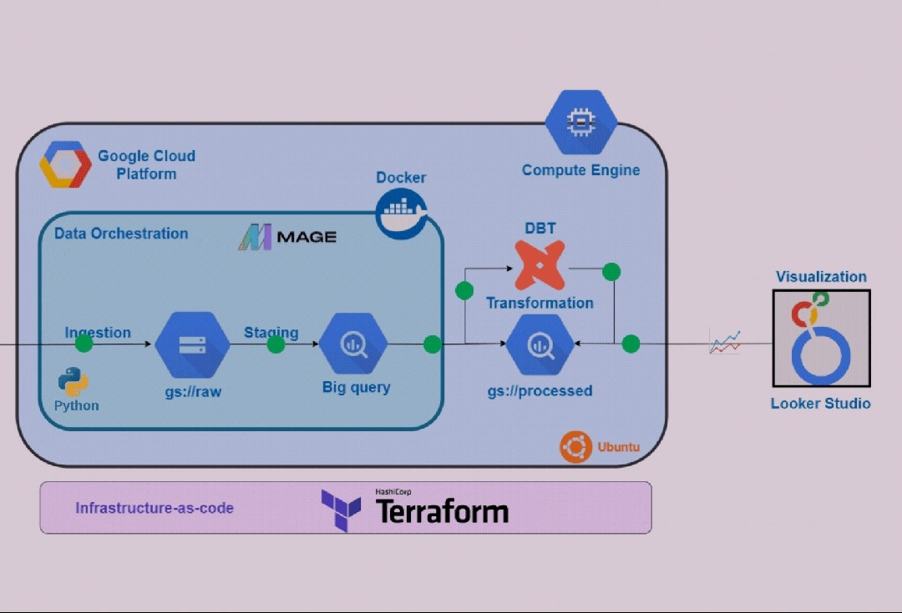

# UK Cycling Data Engineering Project

## Tech Stack
- **Workflow Orchestration**: Mage
- **Cloud**: GCP
- **BigQuery**
- **Docker**
- **dbt**
- **Infrastructure as Code (IaC)**: Terraform
- **Visualization**: Looker Studio

## Overview
This project aims to create a robust data pipeline orchestrated by Mage, utilizing various technologies and tools to process and visualize cycling data in the UK.

## Objective
The primary goal is to apply the knowledge gained from the Data Talks Club Data Engineering Zoomcamp to construct an end-to-end data pipeline.

## Problem Statement
The task involves developing a dashboard with two tiles using the dataset provided by [Transport for London (TfL)](https://cycling.data.tfl.gov.uk/). Here's the breakdown of the project:

1. **Pipeline for Data Processing**: Create a pipeline to process the dataset and store it in a datalake on Google Cloud Platform (GCP).

2. **Pipeline for Data Warehousing**: Develop a pipeline to move the processed data from the datalake to a data warehouse in BigQuery.

3. **Data Transformation with dbt**: Transform the data within the data warehouse using dbt to prepare it for visualization on the dashboard.

4. **Dashboard Visualization**: Build a dashboard to visualize the transformed data.

## Data Pipeline
The data pipeline will be implemented as a batch pipeline, processing data in regular intervals to ensure up-to-date insights are available for visualization on the dashboard.
